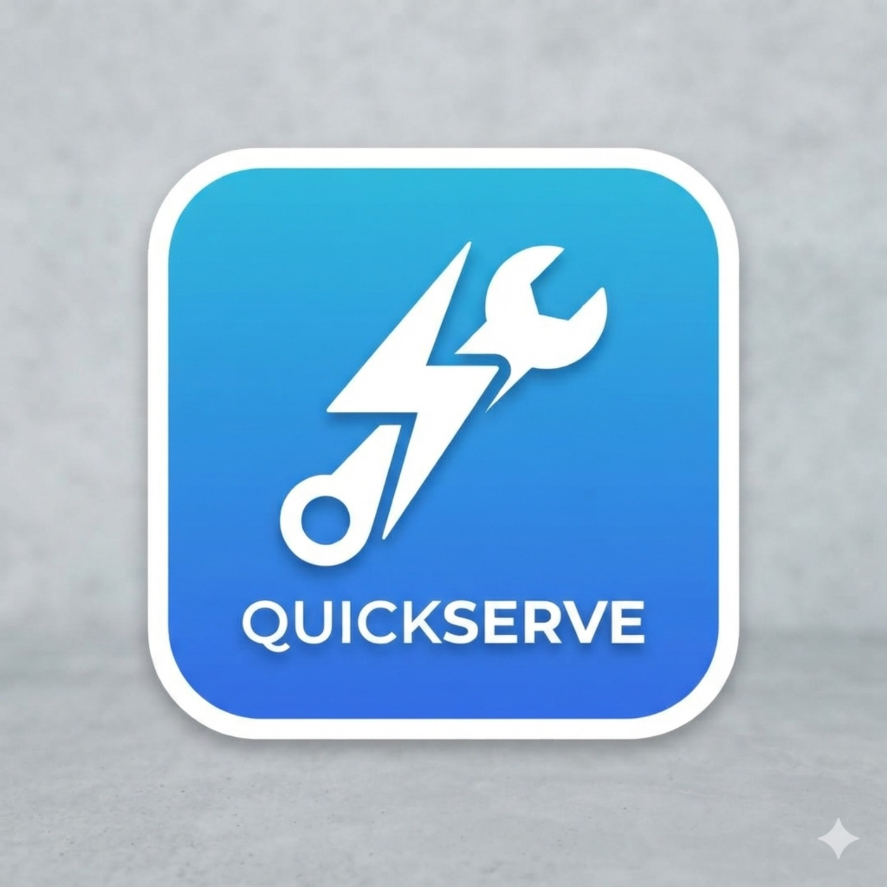
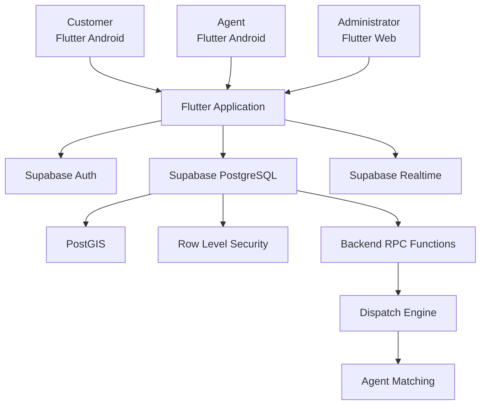

<p align="center">
  
</p>

# ⚡ QuickServe

### A simple, reliable way to request, assign, track, and complete local services.

**Customer → Request → Smart Dispatch → Agent → Completion**

QuickServe is a full-stack service management platform built with Flutter and Supabase. Customers create service requests, field service agents manage and complete jobs, and administrators maintain operational control from a web portal.

<p align="center">
  
  
  
  
  
  
  
  
</p>

---

## 📌 Table of Contents
- [Overview](#-overview)
- [Why QuickServe?](#-why-quickserve)
- [How It Works](#-how-it-works)
- [Features](#-features)
- [Request Lifecycle](#-request-lifecycle)
- [Smart Dispatch](#-smart-dispatch)
- [Real-Time Location & Privacy](#-real-time-location--privacy)
- [Architecture](#-architecture)
- [Technology Stack](#-technology-stack)
- [Database](#-database)
- [Security](#-security)
- [Screens / Visuals](#-screens--visuals)
- [Hosting](#-hosting)
- [Getting Started](#-getting-started)
- [Testing](#-testing)
- [Demo Credentials](#-demo-credentials)
- [Documentation](#-documentation)
- [Project Structure](#-project-structure)
- [Future Improvements](#-future-improvements)

---

## ✦ Overview

QuickServe is an end-to-end **service request and dispatch platform** for everyday local services.

Instead of requiring customers to phone calls, wait without updates, or face unpredictable dispatch, QuickServe turns service delivery into a connected, transparent workflow.

Supported Service Categories:
- ❄️ **AC Servicing**
- 🔧 **Plumbing**
- ⚡ **Electrical**
- 🧹 **Cleaning**

Every request is stored securely, matched with an eligible service agent using spatial proximity and availability, and tracked in real time until completion.

- **Customers**: Request, schedule, and track services from their mobile app.
- **Service Agents**: Receive, accept, and fulfill jobs from their field mobile app.
- **Administrators**: Control requests, agents, customers, and overrides via the web portal.

> **Key Principle**: *The app handles the experience. The backend remains the authority.*

Authentication, authorization, dispatch, assignment, and state machine transitions are enforced by Supabase database policies (RLS) and PostgreSQL RPCs rather than trusting client state.

---

## ✦ Why QuickServe?

Finding a qualified service provider is only step one. A real-world operational service platform must also manage:
- Agent availability and operational radius
- Automated candidate dispatch with response windows
- Live status tracking and location privacy
- Operational payment recording
- Multi-role permission boundaries

QuickServe models a service request as a continuous lifecycle:

```text
Create → Dispatch → Offer → Accept → Start → Complete
```

This structure gives customers total visibility, agents a streamlined workflow, and administrators complete oversight.

---

## ✦ How It Works

```text
                     QUICKSERVE
                          │
             ┌────────────┼────────────┐
             │            │            │
             ▼            ▼            ▼
         CUSTOMER       AGENT        ADMIN
          Mobile        Mobile        Web
             │            │            │
             └────────────┼────────────┘
                          │
                          ▼
                      SUPABASE
             ┌────────────┼────────────┐
             │            │            │
            Auth       PostgreSQL   Realtime
                         + PostGIS
             │            │            │
             └────────────┼────────────┘
                          │
                          ▼
                    Smart Dispatch
```

### 1. Request Creation
The customer picks a service, fills out details, specifies an address with map coordinates, sets a preferred date/time, and chooses priority.

Every request generates a tracking code format:
`REQ-2026-000123`

### 2. Backend Agent Selection
The backend spatial engine evaluates eligible candidates based on:
- Agent active status & verification
- Distance within configured radius (`10 km – 20 km`, default `15 km`)
- Capability matching for requested service
- Current workload balancing

### 3. Agent Offer Window
When a candidate is identified, a temporary offer is dispatched with a response window (~120 seconds). Supabase Realtime pushes the offer directly to the agent's screen. If rejected or expired, it automatically redispatches to the next candidate.

---

## ✦ Features

### 👤 Customer Features
- **Account Management**: Register, sign in, update profile.
- **Service Request**: Category selection, detailed description, priority, scheduled date/time, location picker.
- **Tracking & History**: Live status updates, active agent tracking when permitted, history view.
- **Cancellation & Payment**: Cancel eligible pending requests, view recorded payment details.

### 🛠️ Service Agent Features
- **Field Management**: Sign in, toggle active availability, adjust service radius (`10–20 km`), GPS readiness indicator.
- **Dispatch Offers**: Receive real-time job offers with countdown, accept or reject.
- **Job Execution**: Navigation to job site, start service, record status updates and completion notes.
- **Payment & History**: Record cash/UPI payment collection, view job history.

### 👑 Administrator Features
- **Web Dashboard**: High-level platform analytics, real-time request status boards.
- **Entity Management**: Customer accounts, agent profiles, verification toggles.
- **Manual Assignment Overrides**: Dispatch override via secure database RPCs for edge cases.
- **Audit & History**: Comprehensive request lifecycle and payment records.

---

## ✦ Request Lifecycle

QuickServe strictly enforces state machine transitions at the database layer:

```text
┌──────────┐
│ PENDING  │
└────┬─────┘
     │
     ▼
┌──────────────┐
│ DISPATCHING  │
└────┬─────────┘
     │
     ▼
┌──────────┐
│ ASSIGNED │
└────┬─────┘
     │
     ▼
┌─────────────┐
│ IN_PROGRESS │
└────┬────────┘
     │
     ▼
┌───────────┐
│ COMPLETED │
└───────────┘
```

- Eligible requests can be cancelled prior to active execution.
- Terminal states (`COMPLETED`, `CANCELLED`) are protected from accidental state mutations.

---

## ✦ Smart Dispatch

Dispatch logic runs server-side to guarantee fairness, speed, and safety against race conditions:

```text
Workload Check ──► Spatial Proximity (PostGIS) ──► Deterministic Agent ID Ranking
```

- **PostGIS Spatial Queries**: Uses `ST_DWithin` on geography types to match job locations against active agent coordinates.
- **Concurrency Control**: Utilizes database locking mechanisms to prevent double-assignment races across simultaneous dispatch cycles.

---

## ✦ Real-Time Location & Privacy

QuickServe balances operational real-time tracking with strict privacy rules:

```text
Offer Pending / Not Accepted
      │
      ▼
Customer Tracking Disabled
      │
      ▼
Agent Accepts Offer & Starts Job
      │
      ▼
Authorized Live GPS Tracking Active
      │
      ▼
Job Completed / Cancelled
      │
      ▼
Live Tracking Session Ends Immediately
```

- Device GPS is utilized during active service delivery.
- Unlimited historical location tracking is intentionally excluded to safeguard agent privacy.

---

## ✦ Architecture



### Architecture Layers

| Layer | Technology | Responsibility |
|---|---|---|
| **Mobile App** | Flutter | Customer and Agent Android applications |
| **Web Portal** | Flutter Web | Admin Operations Dashboard |
| **State Management** | Riverpod | Reactive application state |
| **Navigation** | go_router | Declarative, route-guarded navigation |
| **Maps & Location** | flutter_map + OpenStreetMap + Geolocator | Interactive map UI & device GPS |
| **Authentication** | Supabase Auth | User identity, session tokens, JWTs |
| **Database & Spatial**| PostgreSQL + PostGIS | Relational data & geospatial indexing |
| **Security & Logic** | Supabase RLS + PostgreSQL RPCs | Database policies & backend business logic |
| **Realtime Engine** | Supabase Realtime | Live dispatch offers & status streaming |
| **Web Hosting** | Firebase Hosting | Production CDN hosting for Flutter Web |

---

## ✦ Technology Stack

### Frontend
- **Flutter & Dart**: Cross-platform client framework
- **Riverpod**: State management & dependency injection
- **go_router**: Routing & navigation guards
- **flutter_map**: Open-source mapping integration

### Backend & Database
- **Supabase**: Open-source backend infrastructure
- **PostgreSQL**: Primary database engine
- **PostGIS**: Geographic objects & spatial indexing
- **Supabase Auth & Realtime**: Identity & WebSocket data streaming
- **Row Level Security (RLS)**: Fine-grained access control policies

### Infrastructure & Hosting
- **Firebase Hosting**: High-performance static SPA hosting for Flutter Web
- **GitHub**: Version control & project repository

---

## ✦ Database

The database is built around relational integrity and spatial indexing:

```text
┌─────────────┐
│   profiles  │
└──────┬──────┘
       │
       ├───────────────┐
       │               │
       ▼               ▼
┌──────────────┐  ┌────────────────┐
│agent_profiles│  │service_requests│
└──────────────┘  └───────┬────────┘
                           │
                           ▼
                  ┌──────────────────┐
                  │service_assignments│
                  └─────────┬────────┘
                            │
              ┌─────────────┼─────────────┐
              ▼             ▼             ▼
       request history   locations     payments
```

### Core Tables
- `profiles`: Core user record linked to `auth.users` with role identifiers (`customer`, `agent`, `admin`).
- `agent_profiles`: Agent operational status, service radius, verification flag, service categories.
- `service_requests`: Customer requests, status lifecycle, location geometry.
- `service_assignments`: Active assignments, dispatch offer states, timestamps.
- `agent_locations`: Agent GPS positions indexed with PostGIS geography points.
- `payments`: Payment records (amount, currency, method, status, timestamp).
- `request_status_history`: Comprehensive state transition audit log.

Detailed database schema documentation can be found in [docs/DATABASE.md](docs/DATABASE.md).

---

## ✦ Security

### 1. Backend Authorization & RLS
Client-side role representations are treated purely as UI hints. Every read/write operation is validated by database Row Level Security (RLS) policies and security-definer PostgreSQL functions.

### 2. Protected Administrative RPCs
Critical administrative actions (e.g., manual agent assignment) execute through protected functions such as `admin_assign_service_request()`, which explicitly check `profiles.role = 'admin'` from the authenticated session token.

### 3. Client Role Spoofing Prevention
During physical device testing, a client-side role switcher was identified and completely eliminated. Roles are strictly derived from Supabase Auth and verified at the database level on every RPC invocation.

### 4. Credential & Environment Protection
- Only public keys (`SUPABASE_URL`, `SUPABASE_ANON_KEY`) are bundled into client builds.
- Service role keys, database passwords, and secrets are strictly excluded from client repositories.

Detailed security architecture details can be found in [docs/SECURITY.md](docs/SECURITY.md).

---

## ✦ Screens / Visuals

<p align="center">
  
</p>

---

## ✦ Hosting

QuickServe Flutter Web application is configured for deployment on **Firebase Hosting**.

- **Frontend**: Hosted on Firebase Hosting CDN as a Single Page Application (SPA).
- **Backend**: Supabase continues to serve 100% of authentication, database, spatial dispatch, and realtime streaming.

> **Note**: Firebase is used strictly as a static web host. No Firebase SDKs (`firebase_core`, `cloud_firestore`, etc.) are compiled into the Flutter application.

Full deployment steps and local verification instructions are available in [docs/HOSTING.md](docs/HOSTING.md).

---

## ✦ Getting Started

### 1. Prerequisites
- **Flutter SDK**: `^3.27.0` (or compatible Flutter 3.x)
- **Dart SDK**: Bundled with Flutter
- **Android Studio / Android SDK**: For Android builds
- **Supabase Account**: Project configured with database migrations & PostGIS
- **Git**

Verify your environment:
```bash
flutter doctor
```

### 2. Clone Repository
```bash
git clone https://github.com/pranav122005/Quickserve.git
cd Quickserve
```

### 3. Install Dependencies
```bash
flutter pub get
```

### 4. Environment Setup
Create a `.env` file in the root directory (refer to `.env.example`):
```env
SUPABASE_URL=https://your-supabase-project.supabase.co
SUPABASE_ANON_KEY=your-supabase-anon-key
```

### 5. Run Mobile App (Android)
```bash
flutter run
```

### 6. Run Web Portal (Admin)
```bash
flutter run -d chrome
```

### 7. Build Web (Release for Hosting)
```bash
flutter build web --release
```

---

## ✦ Testing

QuickServe includes unit and widget test suites verifying core logic and state management.

- **Automated Tests**: All `83 / 83` tests passing cleanly.
- **Static Analysis**: `flutter analyze` reports zero issues.
- **Physical Device Testing**: Verified end-to-end workflow on **Motorola Edge 70 Fusion (Android 16)**.

To execute tests and analysis:
```bash
flutter analyze
flutter test
```

For complete test execution logs and verification scenarios, refer to [docs/DEMO.md](docs/DEMO.md).

---

## ✦ Demo Credentials

For testing and demonstration, use the pre-configured roles below (refer to [docs/DEMO.md](docs/DEMO.md) for testing details):

| Role | Interface | Account Type |
|---|---|---|
| **Customer** | Android App | Customer account for creating requests |
| **Agent** | Android App | Field agent account for accepting & fulfilling requests |
| **Admin** | Flutter Web | Administrator account for platform overview |

---

## ✦ Documentation

Comprehensive documentation files are located in the `docs/` directory:

- 🏗️ [Architecture Guide](docs/ARCHITECTURE.md) - System architecture, component models, and data flows.
- 🗄️ [Database Schema](docs/DATABASE.md) - Tables, functions, RLS policies, and PostGIS setup.
- 🔒 [Security Policy](docs/SECURITY.md) - RLS model, role enforcement, and security hardening.
- 🧪 [Demo & Testing Guide](docs/DEMO.md) - Test breakdown, demo steps, and device verification notes.
- 🌐 [Hosting Guide](docs/HOSTING.md) - Web build procedures and Firebase Hosting configuration.

---

## ✦ Project Structure

```text
Quickserve/
├── android/                   # Android native platform configuration & launcher icons
├── ios/                       # iOS native platform configuration
├── web/                       # Web entry points & index.html template
├── lib/                       # Application source code
│   ├── core/                  # Shared utilities, constants, theme, network clients
│   └── features/              # Feature modules (auth, customer, agent, admin, requests)
├── test/                      # Unit and widget test suite (83 passing tests)
├── supabase/                  # Database migrations, seed data & RLS policies
│   └── migrations/
├── docs/                      # Technical documentation & project assets
│   ├── assets/
│   │   ├── quickserve-logo.jpg
│   │   └── quickserve-hero.png
│   ├── ARCHITECTURE.md
│   ├── DATABASE.md
│   ├── DEMO.md
│   ├── HOSTING.md
│   └── SECURITY.md
├── .env.example               # Template for environment configuration
├── .gitignore                 # Excluded paths and build artifacts
├── firebase.json              # Firebase Hosting configuration for Flutter Web
├── pubspec.yaml               # Flutter package dependencies
└── README.md                  # Project documentation overview
```

---

## ✦ Future Improvements

Planned enhancements for future releases:
- Push notifications via FCM / Web Push
- Multi-provider OAuth (Google / Apple Sign-In)
- Customer ratings and agent feedback system
- Automated payment gateway integration (Stripe / Razorpay)
- Route optimization for field agents

---

## ✦ Brand & License

<p align="center">
  <br>
  <strong>QuickServe</strong><br>
  <em>Request it. Dispatch it. Complete it.</em>
</p>

---

<p align="center">
  <strong>Built with Flutter + Supabase</strong><br>
  Making local service operations simpler, faster, and more connected.
</p>
