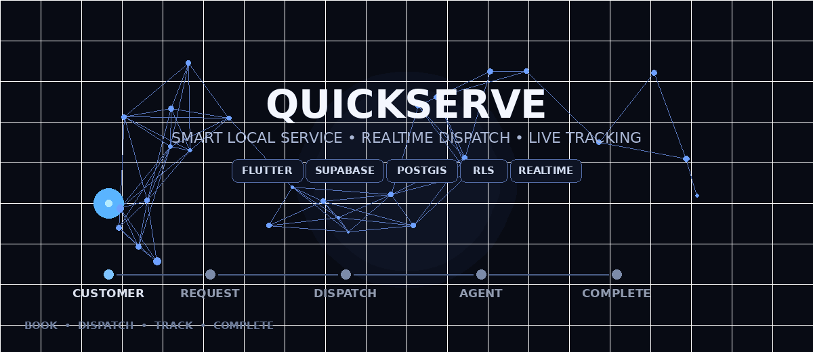

<div align="center">



# ⚡ QuickServe

### Smart Local Service Request & Dispatch Platform

<p>
  <strong>Request a service. Find the right agent. Track the job. Get it completed.</strong>
</p>

<p>
  QuickServe is a full-stack platform that connects customers with local service agents
  through secure authentication, spatial dispatch, realtime updates and role-based operations.
</p>

<br>

<a href="#-what-is-quickserve">What is QuickServe?</a> •
<a href="#-how-it-works">How it Works</a> •
<a href="#-features">Features</a> •
<a href="#-architecture">Architecture</a> •
<a href="#-setup">Setup</a> •
<a href="#-security">Security</a>

<br><br>


</div>

---

## ✦ What is QuickServe?

QuickServe is a service-request and dispatch platform designed for businesses that need to coordinate **customers, field agents and administrators** from one system.

A customer can request a service such as:

- ❄️ AC Servicing
- 🔧 Plumbing
- ⚡ Electrical
- 🧹 Cleaning

The request is stored in the backend and can be dispatched to an eligible service agent based on operational conditions such as **availability, service radius, verification, capability and current workload/distance**.

Once an agent accepts a request, the customer can follow the service lifecycle and, while the job is active, receive the agent's current location. Agents can manage the job from their mobile workflow, while administrators can monitor and manage operations through the web interface.

The important design principle is simple:

> **The client provides the experience; the backend remains the authority for authentication, authorization, assignment and service state.**

---

## ✦ The Problem

Traditional local-service workflows often depend on phone calls, manual assignment and fragmented communication.

That creates problems such as:

```text
Customer
   │
   ├── Calls service provider
   │
   ├── Explains problem
   │
   ├── Waits for agent assignment
   │
   └── Has limited visibility
            │
            ▼
      Manual Operations
            │
            ├── Find available agent
            ├── Check location
            ├── Assign job
            └── Track completion
```

QuickServe turns this into a structured digital workflow.

---

## ✦ The QuickServe Approach

```text
┌──────────────┐
│   CUSTOMER   │
│ Create Job   │
└──────┬───────┘
       │
       ▼
┌──────────────────────┐
│   QUICK SERVE CORE   │
│ Auth • RLS • PostGIS │
│ Dispatch • Realtime  │
└──────┬───────────────┘
       │
       ├───────────────────┐
       ▼                   ▼
┌──────────────┐   ┌──────────────┐
│    AGENT     │   │    ADMIN     │
│ Execute Job  │   │ Operate Core │
└──────────────┘   └──────────────┘
```

The result is a single service lifecycle instead of disconnected customer, agent and admin processes.

---

# ✦ How It Works

## 1. Customer Creates a Request

The customer selects a service and provides the information needed to execute it.

```text
Service Type
     +
Description
     +
Service Address
     +
Preferred Date / Time
     +
Priority
     +
Location
     │
     ▼
Service Request
```

Each request receives a unique request identifier such as:

```text
REQ-2026-000123
```

---

## 2. Backend Evaluates Agents

QuickServe does not allow the Flutter client to decide which agent should receive a job.

The backend evaluates eligible agents using information such as:

- Current availability
- Service radius
- Current location
- Verification status
- Service capability
- Existing workload
- Distance from the request

Spatial calculations are handled using **PostGIS**.

---

## 3. Agent Receives an Offer

An eligible agent receives a service offer with a limited response window.

```text
                    NEW REQUEST
                        │
                        ▼
                Eligible Agents
                        │
                        ▼
                 Candidate Ranking
                        │
                        ▼
                 Agent Offer
                    120 sec
                  ┌─────┴─────┐
                  ▼           ▼
               ACCEPT       REJECT
                  │           │
                  ▼           ▼
              ASSIGNED    Next Candidate
```

The dispatch mechanism uses database-side locking so concurrent requests do not accidentally reserve the same agent.

---

## 4. Agent Executes the Job

After accepting:

```text
ACCEPTED
   │
   ▼
IN PROGRESS
   │
   ▼
COMPLETED
```

The agent can:

- Start the service
- Add work notes
- Update the service state
- Share active-job location
- Record payment information
- Complete the request

---

## 5. Customer Tracks the Active Service

After an assignment has been accepted, the customer can access the agent's current location while the service is active.

The location is intentionally restricted:

```text
Customer
   │
   └──► Assigned Agent
             │
             └──► Current Active Location

Other Customers ──X──► Agent Location
Anonymous User ───X──► Agent Location
```

QuickServe uses current location for operational tracking rather than maintaining an unlimited historical GPS trail.

---

# ✦ User Roles

<table>
<tr>
<td width="33%" valign="top">

## 👤 Customer

The customer is the person requesting a service.

### Can

- Register and log in
- Browse services
- Create service requests
- Select preferred date/time
- Set address and priority
- View own requests
- Track request status
- View status history
- View assigned agent
- View active agent location
- View payment information
- Cancel eligible requests
- Manage profile
- Log out

</td>

<td width="33%" valign="top">

## 🛠️ Service Agent

The agent performs the requested service.

### Can

- Log in
- Configure availability
- Configure service radius
- Receive offers
- Accept/reject offers
- View assigned jobs
- Start service
- Add notes
- Complete service
- Record payment
- Share active-job location
- Manage profile
- Log out

</td>

<td width="33%" valign="top">

## 🧑‍💼 Administrator

The administrator manages service operations.

### Can

- View operational dashboard
- View customers
- View agents
- View requests
- Assign agents
- Inspect request details
- Manage request state
- View agent operational locations
- View payment records
- Monitor the service operation

</td>
</tr>
</table>

---

# ✦ Request Lifecycle

<div align="center">

```text
┌───────────┐
│  PENDING  │
└─────┬─────┘
      │
      ▼
┌──────────────┐
│ DISPATCHING  │
└──────┬───────┘
       │
       ▼
┌────────────┐
│  ASSIGNED  │
└──────┬─────┘
       │
       ▼
┌──────────────┐
│ IN_PROGRESS  │
└──────┬───────┘
       │
       ▼
┌────────────┐
│ COMPLETED  │
└────────────┘

PENDING / DISPATCHING / eligible states
                │
                ▼
           CANCELLED
```

</div>

The state is maintained by the backend and exposed to each role according to its authorization boundaries.

---

# ✦ Smart Dispatch Engine

QuickServe's dispatch layer is designed around **server-side spatial and concurrency control**.

### Agent eligibility

An agent can be considered only when the relevant operational conditions are satisfied:

| Condition | Purpose |
|---|---|
| Availability | Agent must be available |
| Service radius | Request must fall within configured range |
| Current location | Needed for spatial eligibility |
| Verification | Prevent unverified agents from normal dispatch |
| Capability | Agent should support the requested service |
| Workload | Used for fair candidate selection |

### Candidate ranking

The current dispatch strategy uses:

```text
1 ─ Lowest active workload
2 ─ Shortest eligible distance
3 ─ Agent ID tie-breaker
```

This creates deterministic selection while considering both workload and proximity.

### Concurrency

The reservation process uses:

```sql
FOR UPDATE SKIP LOCKED
```

so competing transactions can skip candidates already being reserved instead of waiting on the same row indefinitely.

### Offer expiration

Offers have a limited **120-second response window**.

An expired or rejected offer can proceed to another eligible candidate through the dispatch mechanism.

---

# ✦ Architecture

```text
                           QUICK SERVE
                                │
                ┌───────────────┴───────────────┐
                │                               │
         Flutter Mobile                    Flutter Web
         Customer / Agent                  Admin Portal
                │                               │
                └───────────────┬───────────────┘
                                │
                       Riverpod + go_router
                                │
                                ▼
                         Supabase Client
                                │
        ┌───────────────────────┼───────────────────────┐
        │                       │                       │
        ▼                       ▼                       ▼
   Supabase Auth           PostgreSQL              Realtime
                                │
                     ┌──────────┴──────────┐
                     │                     │
                  PostGIS                  RLS
                     │                     │
                     └──────────┬──────────┘
                                │
                         Dispatch Functions
                                │
                                ▼
                       Service Assignment
```

---

# ✦ Technology Stack

| Layer | Technology | Purpose |
|---|---|---|
| Mobile | Flutter | Customer & Agent applications |
| Web | Flutter Web | Administrative portal |
| Language | Dart | Application development |
| State Management | Riverpod | Reactive application state |
| Navigation | go_router | Role-aware navigation |
| Backend | Supabase | Hosted application backend |
| Authentication | Supabase Auth | Authentication and sessions |
| Database | PostgreSQL | Core relational data |
| Spatial Database | PostGIS | Location/radius queries |
| Authorization | PostgreSQL RLS | Server-side access control |
| Realtime | Supabase Realtime | Live application updates |
| Maps | flutter_map | Map rendering |
| Map Data | OpenStreetMap | Map tiles/data |
| GPS | geolocator | Device location |
| Testing | Flutter test | Automated testing |
| Source Control | Git/GitHub | Version control |

---

# ✦ Database Model

The core data model is centered around users, requests, assignments and operational records.

```text
┌───────────────┐
│    PROFILES   │
└───────┬───────┘
        │
        ├──────────────► AGENT_PROFILES
        │
        └──────────────► AGENT_LOCATIONS


┌───────────────────┐
│ SERVICE_REQUESTS  │
└─────────┬─────────┘
          │
          ├──────────────► SERVICE_ASSIGNMENTS
          │                      │
          │                      └──► AGENT
          │
          ├──────────────► REQUEST_STATUS_HISTORY
          │
          └──────────────► PAYMENTS
```

### Main entities

#### `profiles`

Stores application identity and role information.

Roles:

```text
customer
agent
admin
```

#### `service_requests`

Stores the customer's requested service, including:

- Customer
- Category
- Title
- Description
- Address
- Priority
- Status
- Service location
- Timestamps

#### `service_assignments`

Connects requests to service agents and stores assignment state.

#### `agent_profiles`

Stores operational agent information such as:

- Service radius
- Availability
- Verification state

#### `agent_locations`

Stores the agent's current operational location.

#### `request_status_history`

Maintains the lifecycle history of a request.

#### `payments`

Stores payment records associated with completed service workflows.

---

# ✦ Authentication & Authorization

QuickServe separates **authentication** from **authorization**.

```text
             Authentication
                   │
                   ▼
             Supabase Auth
                   │
                   ▼
             User Session
                   │
                   ▼
          PostgreSQL RLS
                   │
          ┌────────┼────────┐
          ▼        ▼        ▼
       Customer   Agent    Admin
```

### Public registration

A public registration creates a **customer** account.

The client does not get to select:

```text
❌ admin
❌ agent
```

as its registration role.

Agent and administrator accounts are provisioned separately.

This prevents a malicious client from simply submitting:

```json
{
  "role": "admin"
}
```

and receiving administrator privileges.

---

# ✦ Row Level Security

Database authorization is enforced with PostgreSQL Row Level Security.

Protected application resources include:

```text
profiles
service_requests
service_assignments
agent_profiles
agent_locations
request_status_history
payments
```

Security-sensitive helper functions are implemented as controlled `SECURITY DEFINER` functions with an explicit `search_path`.

This keeps authorization decisions on the backend rather than relying only on Flutter UI visibility.

---

# ✦ Location Privacy

Location is one of the most sensitive parts of a service application.

QuickServe therefore follows a restricted visibility model.

| User | Can access |
|---|---|
| Agent | Own current location |
| Assigned customer | Current location of assigned agent during active service |
| Administrator | Operational agent location |
| Other customers | No access |
| Anonymous users | No access |

### Design decisions

- Foreground GPS is used for the active-job workflow.
- No fake production GPS coordinates are used.
- Unlimited historical GPS tracking is not part of the MVP.
- Customer location visibility begins only when an assignment is active.
- Terminal requests stop exposing the active agent location.

---

# ✦ Realtime Behaviour

Realtime updates are used where immediate state changes matter.

Examples include:

```text
Request Created
      │
      ▼
Assignment Created
      │
      ▼
Agent Accepts
      │
      ▼
Request Assigned
      │
      ▼
Agent Starts
      │
      ▼
Request In Progress
      │
      ▼
Agent Completes
      │
      ▼
Request Completed
```

This allows the customer, agent and administrator interfaces to stay synchronized with backend state without repeatedly rebuilding the application state manually.

---

# ✦ Payment Handling

The MVP records payment information rather than integrating a payment gateway.

Supported payment methods include:

```text
Cash
UPI
Other
```

The payment record is associated with the relevant service request and customer/agent context.

A future payment gateway can be added without changing the fundamental request lifecycle.

---

# ✦ Application Screens

## Customer Flow

```text
┌─────────┐
│  LOGIN  │
└────┬────┘
     ▼
┌─────────┐
│  HOME   │
└────┬────┘
     ├──────────────┐
     ▼              ▼
 SERVICES       MY REQUESTS
     │              │
     ▼              ▼
CREATE REQUEST   DETAILS
     │              │
     └──────┬───────┘
            ▼
       LIVE STATUS
            │
            ▼
       ACTIVE AGENT
            │
            ▼
          PAYMENT
```

## Agent Flow

```text
LOGIN
  │
  ▼
DASHBOARD
  │
  ├── Availability
  ├── Service Radius
  └── Offers
          │
          ▼
       ACCEPT
          │
          ▼
      ACTIVE JOB
          │
       ┌──┴──┐
       ▼     ▼
     START  LOCATION
       │
       ▼
    COMPLETE
       │
       ▼
    PAYMENT
```

## Admin Flow

```text
ADMIN LOGIN
     │
     ▼
 DASHBOARD
     │
 ┌───┼────────┬──────────┐
 ▼   ▼        ▼          ▼
Users Agents Requests Payments
             │
             ▼
       Request Details
             │
       ┌─────┴─────┐
       ▼           ▼
   Assign Agent  Status
```

---

# ✦ Visual Showcase

<p align="center">
  
  
  
</p>

<p align="center">
  <sub>Customer and field-agent experience</sub>
</p>

<br>

<p align="center">
  
</p>

<p align="center">
  <sub>Administrative operations and service management</sub>
</p>

---

# ✦ Project Structure

```text
Quickserve/
│
├── android/
├── ios/
├── web/
│
├── lib/
│   ├── core/
│   │   ├── config/
│   │   ├── routing/
│   │   ├── theme/
│   │   └── utils/
│   │
│   ├── data/
│   │   ├── models/
│   │   ├── repositories/
│   │   └── services/
│   │
│   ├── features/
│   │   ├── auth/
│   │   ├── customer/
│   │   ├── agent/
│   │   └── admin/
│   │
│   └── main.dart
│
├── supabase/
│   └── migrations/
│
├── test/
│
├── docs/
│   └── assets/
│
├── .env.example
├── .gitignore
├── pubspec.yaml
└── README.md
```

---

# ✦ Getting Started

## Prerequisites

Install:

- Flutter SDK
- Dart SDK
- Android Studio / Android SDK
- Git
- A Supabase project

Verify your environment:

```bash
flutter --version
flutter doctor
```

---

## Clone the Repository

```bash
git clone https://github.com/pranav122005/Quickserve.git
cd Quickserve
```

---

## Install Dependencies

```bash
flutter pub get
```

---

## Configure Supabase

Create a local environment configuration based on `.env.example`.

Example:

```env
SUPABASE_URL=your_supabase_project_url
SUPABASE_ANON_KEY=your_public_anon_or_publishable_key
```

Only public client credentials belong in the Flutter application.

> **Never place a Supabase `service_role` key, database password, private API key or other secret in the mobile/web client.**

---

## Database Setup

Configure the Supabase project with:

1. PostgreSQL
2. PostGIS
3. Supabase Authentication
4. QuickServe database tables
5. Row Level Security policies
6. Dispatch functions
7. Required indexes
8. Realtime configuration

Apply the migration files in:

```text
supabase/migrations/
```

Do not manually weaken RLS to make the application work.

---

## Run Web

```bash
flutter run -d chrome
```

---

## Run Android

Check connected devices:

```bash
flutter devices
```

Then:

```bash
flutter run
```

For a release APK:

```bash
flutter build apk --release
```

The generated APK is typically available under:

```text
build/app/outputs/flutter-apk/app-release.apk
```

---

# ✦ Testing

## Static Analysis

```bash
flutter analyze
```

## Automated Tests

```bash
flutter test
```

## Manual End-to-End Scenario

A complete functional test should follow this sequence:

```text
CUSTOMER
   │
   ├── Register / Login
   │
   ├── Create Request
   │
   ▼
BACKEND
   │
   ├── Validate Request
   ├── Dispatch
   └── Create Offer
   │
   ▼
AGENT
   │
   ├── Receive Offer
   ├── Accept
   ├── Start
   ├── Add Notes
   └── Complete
   │
   ▼
CUSTOMER
   │
   └── Observe Status / Location / Payment
   │
   ▼
ADMIN
   │
   └── Verify Operational State
```

---

# ✦ Error Handling

The application separates user-facing failures from internal technical details.

Examples include:

```text
Authentication Error
Authorization Error
Network Error
Database Error
Invalid Request
Session Expired
Unavailable Service
```

Sensitive information such as:

```text
Passwords
Private keys
Service-role credentials
Database passwords
```

must never be displayed in application logs or user-facing errors.

---

# ✦ Repository Structure for Documentation

The recommended documentation layout is:

```text
docs/
├── ARCHITECTURE.md
├── DATABASE.md
├── SECURITY.md
├── WALKTHROUGH.md
└── assets/
    ├── quickserve-hero.gif
    ├── quickserve-hero.png
    ├── customer-dashboard.png
    ├── create-request.png
    ├── agent-dashboard.png
    ├── agent-offer.png
    └── admin-dashboard.png
```

---

# ✦ Design Philosophy

QuickServe is built around five principles:

<table>
<tr>
<td align="center" width="20%">🔒<br><b>Secure</b><br><sub>Backend-enforced authorization</sub></td>
<td align="center" width="20%">📍<br><b>Spatial</b><br><sub>Location-aware dispatch</sub></td>
<td align="center" width="20%">⚡<br><b>Realtime</b><br><sub>Live operational state</sub></td>
<td align="center" width="20%">📱<br><b>Practical</b><br><sub>Field-friendly workflows</sub></td>
<td align="center" width="20%">🧩<br><b>Modular</b><br><sub>Separated features and services</sub></td>
</tr>
</table>

---

# ✦ Future Extensions

The architecture leaves room for additional capabilities such as:

- Push notifications
- Production payment gateway integration
- Advanced analytics
- Service ratings and reviews
- Automated CI/CD pipelines
- Expanded operational reporting
- Additional service categories
- Advanced agent matching strategies

These can be added without changing the fundamental customer → dispatch → agent → completion workflow.

---

# ✦ License

Add the project's chosen license here before public distribution.

---

<div align="center">

<br>


# ⚡ QuickServe

### **Book. Dispatch. Track. Complete.**

<p>
Built with Flutter, Supabase, PostgreSQL, PostGIS and Realtime.
</p>

<sub>Customer • Service Agent • Administrator</sub>

</div>
