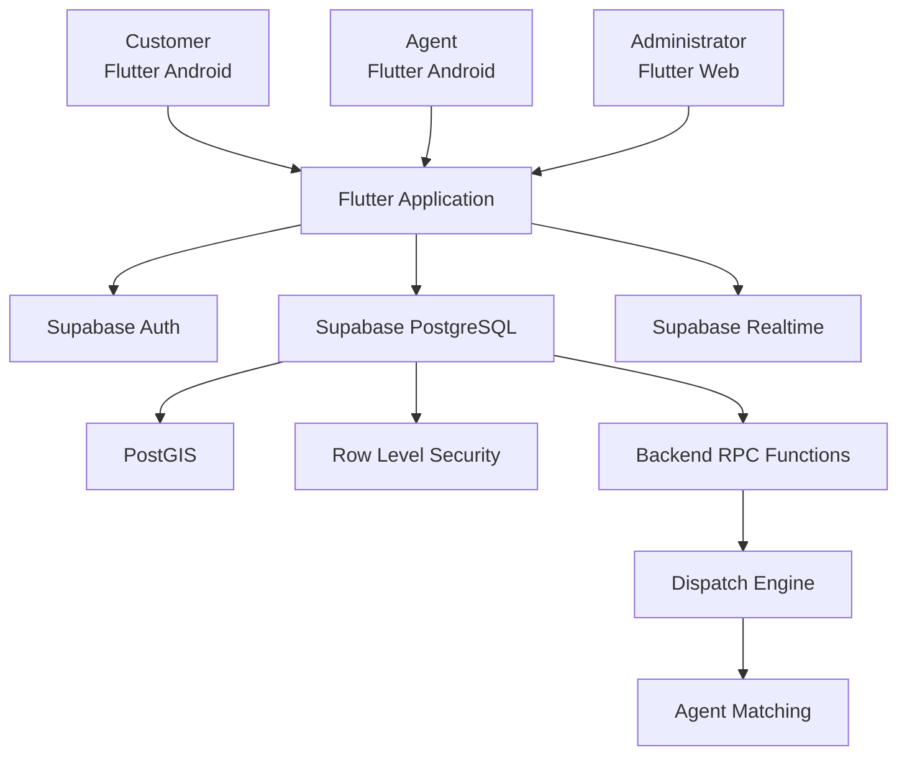

::: {align="center"}
``{=html}

# ⚡ QuickServe

### A simple way to request, assign, track and complete local services.

```{=html}
<p>
```
`<strong>`{=html}Customer → Request → Smart Dispatch → Agent →
Completion`</strong>`{=html}

```{=html}
</p>
```
```{=html}
<p>
```
QuickServe is a full-stack service management platform built with
Flutter and Supabase. Customers create service requests, agents handle
the work, and administrators keep the whole operation under control.

```{=html}
</p>
```
```{=html}
<p>
```
`<a href="#-what-is-quickserve">`{=html}Overview`</a>`{=html} •
`<a href="#-how-it-works">`{=html}How it works`</a>`{=html} •
`<a href="#-features">`{=html}Features`</a>`{=html} •
`<a href="#-architecture">`{=html}Architecture`</a>`{=html} •
`<a href="#-security">`{=html}Security`</a>`{=html} •
`<a href="#-setup">`{=html}Setup`</a>`{=html} •
`<a href="#-testing">`{=html}Testing`</a>`{=html}

```{=html}
</p>
```
```{=html}
<p>
```
``{=html}
``{=html}
``{=html}
``{=html}
``{=html}
``{=html}
``{=html}

```{=html}
</p>
```
:::

------------------------------------------------------------------------

## ✦ What is QuickServe?

QuickServe is a **service request and dispatch platform** for everyday
local services.

Instead of a customer calling someone, waiting for an assignment, and
having no idea what is happening, QuickServe turns the whole process
into one connected workflow.

A customer can request:

-   ❄️ **AC Servicing**
-   🔧 **Plumbing**
-   ⚡ **Electrical**
-   🧹 **Cleaning**

The request is stored securely, matched with an eligible service agent,
and tracked until the job is finished.

At the same time:

-   **Customers** request and track services.
-   **Agents** receive and complete jobs from their phones.
-   **Administrators** manage requests, agents, customers and operations
    from the web portal.

> **The app handles the experience. The backend remains the authority.**

That principle is important throughout QuickServe: authentication,
authorization, dispatch, assignment and request state are enforced on
the backend rather than being trusted only to the client.

------------------------------------------------------------------------

# ✦ The idea in one picture

``` text
                     QUICK SERVE
                          │
             ┌────────────┼────────────┐
             │            │            │
             ▼            ▼            ▼
         CUSTOMER       AGENT        ADMIN
         Mobile        Mobile         Web
             │            │            │
             └────────────┼────────────┘
                          │
                          ▼
                     SUPABASE
             ┌────────────┼────────────┐
             │            │            │
            Auth       PostgreSQL    Realtime
                         + PostGIS
             │            │            │
             └────────────┼────────────┘
                          ▼
                   Smart Dispatch
```

------------------------------------------------------------------------

# ✦ Why we built it this way

The project was designed around a simple real-world problem:

> **When someone needs a service, finding a suitable person is only the
> beginning. The system also needs to manage availability, assignment,
> status, location, communication and completion.**

QuickServe therefore treats a service request as a complete lifecycle
instead of just a form submission.

``` text
Create
  ↓
Dispatch
  ↓
Offer
  ↓
Accept
  ↓
Start
  ↓
Complete
```

That gives the customer visibility, gives the agent a clear workflow,
and gives the administrator operational control.

------------------------------------------------------------------------

# ✦ How QuickServe works

## 1. Customer creates a request

The customer selects a service and enters the information needed to
perform it.

``` text
Service
   +
Title / Description
   +
Address
   +
Preferred Date
   +
Preferred Time
   +
Priority
   +
Location
   │
   ▼
Service Request
```

Every request receives an identifier such as:

``` text
REQ-2026-000123
```

The request begins its backend lifecycle and becomes available for
dispatch.

------------------------------------------------------------------------

## 2. The backend finds suitable agents

The mobile application does **not** decide which agent should receive a
job.

The backend checks operational information such as:

-   Is the agent available?
-   Is the agent verified?
-   Is the agent within the configured service radius?
-   Is the agent capable of handling the requested service?
-   Where is the agent currently located?
-   How much existing work does the agent have?

Geographic matching is handled using **PostGIS**.

The agent service-radius setting is constrained to:

``` text
10 km — 20 km
```

with a default of:

``` text
15 km
```

------------------------------------------------------------------------

## 3. An agent receives an offer

Once an eligible candidate is found, the backend creates a service
offer.

``` text
                  NEW REQUEST
                       │
                       ▼
               Find eligible agents
                       │
                       ▼
                Rank candidates
                       │
                       ▼
                 Create offer
                  120 seconds
                 ┌─────┴─────┐
                 │           │
              ACCEPT       REJECT
                 │           │
                 ▼           ▼
              Assigned    Redispatch
```

The offer has a limited response window of approximately **120
seconds**.

Realtime updates allow the offer to appear in the agent application
without requiring the agent to constantly refresh the screen.

------------------------------------------------------------------------

# ✦ Smart dispatch

Dispatch is implemented as a backend operation.

The candidate ranking considers:

``` text
Workload
   ↓
Distance
   ↓
Stable agent ID
```

This gives the system a deterministic way to balance workload and
proximity.

PostGIS provides the spatial filtering through geographic distance
queries such as `ST_DWithin`.

The dispatch flow also uses database locking to protect against
concurrent assignment races.

------------------------------------------------------------------------

# ✦ Request lifecycle

The main request lifecycle is:

``` text
┌──────────┐
│ PENDING  │
└────┬─────┘
     │
     ▼
┌──────────────┐
│ DISPATCHING  │
└────┬─────────┘
     │
     ▼
┌──────────┐
│ ASSIGNED │
└────┬─────┘
     │
     ▼
┌─────────────┐
│ IN_PROGRESS │
└────┬────────┘
     │
     ▼
┌───────────┐
│ COMPLETED │
└───────────┘
```

Eligible requests can also be cancelled.

Terminal states are protected from accidental reassignment.

------------------------------------------------------------------------

# ✦ The three user experiences

## 👤 Customer

The customer can:

-   Register and sign in
-   Browse services
-   Create service requests
-   Add address and location
-   Select priority
-   Select preferred date/time
-   View their requests
-   Open request details
-   View request history
-   Track the service lifecycle
-   Track an assigned agent when permitted
-   View payment information
-   Cancel eligible requests
-   Manage profile
-   Log out

### Customer flow

``` text
Login
  ↓
Home
  ↓
Choose Service
  ↓
Create Request
  ↓
My Requests
  ↓
Request Details
  ↓
Assigned Agent
  ↓
Track Progress
  ↓
Completed
```

------------------------------------------------------------------------

# ✦ Agent experience

Agents use the mobile application to manage field work.

They can:

-   Sign in
-   Set availability
-   Configure service radius
-   See GPS readiness
-   Receive service offers
-   Accept/reject offers
-   View active jobs
-   Start work
-   Update job state
-   Add notes
-   Record payment information
-   Complete work
-   View profile
-   Log out

### Agent flow

``` text
Login
  ↓
Available
  ↓
Receive Offer
  ↓
Accept
  ↓
Assigned
  ↓
Start Job
  ↓
In Progress
  ↓
Complete
```

The active-job location workflow uses genuine device GPS. The project
does not depend on a fake production location fallback.

------------------------------------------------------------------------

# ✦ Admin experience

The administrator operates the platform through the web portal.

The Admin area provides operational views for:

-   Dashboard
-   Requests
-   Customers
-   Agents
-   Payments
-   Request details
-   Agent assignment
-   Operational status
-   Activity/audit information

### Admin flow

``` text
Admin Login
    ↓
Dashboard
    ├── Requests
    ├── Customers
    ├── Agents
    ├── Payments
    └── Operations
```

An administrator can manually assign an eligible agent through a
protected backend RPC.

------------------------------------------------------------------------

# ✦ Location and privacy

Location is useful for dispatch, but it should not become unlimited
tracking.

QuickServe therefore keeps the location model focused on operational
needs.

``` text
Offer not accepted
      │
      ▼
Customer cannot track agent
      │
      ▼
Agent accepts
      │
      ▼
Authorized live location
      │
      ▼
Active service
      │
      ▼
Completed / Cancelled
      │
      ▼
Live customer tracking ends
```

The system does not intentionally expose an unlimited GPS history to
customers.

------------------------------------------------------------------------

# ✦ Realtime

QuickServe uses **Supabase Realtime** for operational updates.

Examples include:

-   New agent offers
-   Assignment changes
-   Request status changes
-   Active-job updates
-   Authorized location updates

The goal is to make the application feel like one connected system even
though customers, agents and administrators use different interfaces.

------------------------------------------------------------------------

# ✦ Payments

The current payment module is an **operational payment-recording
layer**, not a payment gateway.

It can record:

``` text
Request
Customer
Agent
Amount
Currency
Payment Method
Payment Status
Paid At
```

Supported methods include:

-   Cash
-   UPI
-   Other

This keeps payment tracking inside the service lifecycle without
pretending that QuickServe itself processes a financial transaction.

------------------------------------------------------------------------

# ✦ Architecture



### Architecture layers

  Layer           Technology                    Responsibility
  --------------- ----------------------------- ---------------------------------
  Mobile          Flutter                       Customer and Agent applications
  Web             Flutter Web                   Admin operations
  State           Riverpod                      Application state
  Routing         go_router                     Protected navigation
  Maps            flutter_map + OpenStreetMap   Map rendering
  Location        Geolocator                    Device GPS
  Auth            Supabase Auth                 Authentication/session
  Database        PostgreSQL                    Application data
  Spatial         PostGIS                       Geographic dispatch
  Security        Supabase RLS                  Database authorization
  Backend logic   PostgreSQL RPC                Secure business operations
  Realtime        Supabase Realtime             Live operational updates

------------------------------------------------------------------------

# ✦ Database model

The core database is organized around users, requests, assignments and
operational data.

``` text
┌─────────────┐
│   profiles  │
└──────┬──────┘
       │
       ├───────────────┐
       │               │
       ▼               ▼
┌──────────────┐  ┌────────────────┐
│agent_profiles│  │service_requests│
└──────────────┘  └───────┬────────┘
                           │
                           ▼
                  ┌──────────────────┐
                  │service_assignments│
                  └─────────┬────────┘
                            │
              ┌─────────────┼─────────────┐
              ▼             ▼             ▼
       request history   locations     payments
```

### Main tables

-   `profiles`
-   `service_requests`
-   `service_assignments`
-   `agent_profiles`
-   `agent_locations`
-   `payments`
-   `request_status_history`

The database also contains indexes and constraints required for the
operational workflows.

------------------------------------------------------------------------

# ✦ Authentication & authorization

QuickServe uses **Supabase Auth + PostgreSQL RLS**.

There are three roles:

``` text
CUSTOMER
AGENT
ADMIN
```

The important security rule is:

> **A role shown by the Flutter UI is never considered sufficient
> authorization.**

The backend checks the authenticated user's database identity and role.

------------------------------------------------------------------------

## Role separation

``` text
Customer
 ├── Own requests
 ├── Own operational data
 └── Customer actions

Agent
 ├── Assigned work
 ├── Offers
 ├── Active jobs
 └── Agent actions

Admin
 ├── Operational requests
 ├── Customers
 ├── Agents
 ├── Assignments
 └── Administrative actions
```

------------------------------------------------------------------------

# ✦ Backend authorization

Important operations are protected at the database level.

For example, admin assignment uses a protected RPC:

``` text
admin_assign_service_request()
```

The database verifies that:

``` text
Authenticated User
        ↓
profiles.id
        ↓
profiles.role
        ↓
role = admin
```

Only then is the administrative operation allowed.

This prevents a client from simply changing its local state and
pretending to be an administrator.

------------------------------------------------------------------------

# ✦ Security hardening

Security was treated as part of the architecture rather than something
added at the end.

Implemented protections include:

-   Supabase Row Level Security
-   Role-based authorization
-   Backend authorization checks
-   Protected RPC functions
-   Restricted function execution permissions
-   Controlled `search_path` for security-definer functions
-   Database-side dispatch authorization
-   Protected customer/agent data access
-   Location access based on operational state
-   No client-side role promotion
-   No service-role key in the client
-   No database password in the application
-   Secret scanning before final repository push

The Flutter client may contain the public Supabase URL and public
anon/publishable key, but private backend credentials must remain
server-side.

------------------------------------------------------------------------

# ✦ A security bug we caught

During physical testing, we found an important issue that automated
tests alone did not expose.

The application previously had a development role switcher.

A customer could locally switch the Flutter state to:

``` text
ADMIN
```

while the real Supabase account was still:

``` text
CUSTOMER
```

The UI therefore displayed:

``` text
ADMIN
Welcome, New User
```

while PostgreSQL correctly rejected the admin operation.

The fix was to remove the client-side role manipulation entirely.

The final role flow is now:

``` text
Supabase Auth
      ↓
profiles
      ↓
Database role
      ↓
Flutter auth state
      ↓
UI / routing
```

This is exactly the kind of issue backend authorization is supposed to
catch.

------------------------------------------------------------------------

# ✦ Error handling

The application handles common operational failures including:

-   Invalid input
-   Authentication failures
-   Authorization failures
-   Network errors
-   Database errors
-   Expired offers
-   Invalid request states
-   Unauthorized data access

The UI presents usable messages rather than exposing raw database
internals.

------------------------------------------------------------------------

# ✦ Testing

QuickServe has automated tests covering the implemented application
behavior.

Latest verified result:

``` text
83 / 83 tests passed
```

Static analysis:

``` text
flutter analyze

No issues found
```

The application was also installed and tested on a physical:

``` text
Motorola Edge 70 Fusion
Android 16
```

A real end-to-end workflow was verified:

``` text
Admin Login
    ↓
Fresh Request
    ↓
Admin Assignment
    ↓
Backend RPC
    ↓
Agent Offer
    ↓
Agent Accept
    ↓
Request → ASSIGNED
```

------------------------------------------------------------------------

# ✦ Project structure

A simplified view of the project:

``` text
Quickserve/
│
├── android/
├── ios/
├── web/
├── lib/
│   ├── core/
│   └── features/
│
├── test/
│
├── docs/
│   ├── assets/
│   ├── ARCHITECTURE.md
│   └── ...
│
├── pubspec.yaml
├── analysis_options.yaml
├── .gitignore
└── README.md
```

The actual repository may contain additional Flutter-generated and
project-specific files.

------------------------------------------------------------------------

# ✦ Getting started

## Requirements

Install:

-   Flutter SDK
-   Dart SDK through Flutter
-   Android Studio / Android SDK for Android development
-   A Supabase project
-   Git

Verify Flutter:

``` bash
flutter --version
```

Verify the project:

``` bash
flutter doctor
```

------------------------------------------------------------------------

## Clone

``` bash
git clone https://github.com/pranav122005/Quickserve.git
cd Quickserve
```

------------------------------------------------------------------------

## Install dependencies

``` bash
flutter pub get
```

------------------------------------------------------------------------

## Configure Supabase

Configure the application's public Supabase connection using the
project's environment/configuration mechanism.

The client should contain only:

``` text
SUPABASE_URL
SUPABASE_ANON_KEY / publishable key
```

Never put:

``` text
service_role
database password
private API keys
```

into the Flutter client.

------------------------------------------------------------------------

# ✦ Run the application

### Android

``` bash
flutter run
```

or select a connected Android device.

### Web

``` bash
flutter run -d chrome
```

### Release Android build

``` bash
flutter build apk --release
```

The generated APK is produced under the Flutter build output directory.

------------------------------------------------------------------------

# ✦ Test

Run static analysis:

``` bash
flutter analyze
```

Run automated tests:

``` bash
flutter test
```

Build Android release:

``` bash
flutter build apk --release
```

------------------------------------------------------------------------

# ✦ Demo accounts

For security, **do not publish real passwords or private credentials in
this README**.

For an evaluator/demo, provide the current test credentials separately.

Expected roles:

  Account         Role
  --------------- ---------------
  Customer demo   Customer
  Agent demo      Agent
  Admin demo      Administrator

The evaluator should use accounts provisioned in the Supabase project
rather than creating arbitrary roles from the registration screen.

------------------------------------------------------------------------

# ✦ Git & repository hygiene

The project follows normal Git hygiene:

-   Meaningful commits
-   Clean working tree
-   `.gitignore`
-   No committed secrets
-   Backend credentials kept out of the client
-   Documentation included with the source
-   Release verification before final submission

The final verified security commit is:

``` text
2f70a7f
fix(security): remove client-side role spoofing and enforce backend RLS authorization
```

------------------------------------------------------------------------

# ✦ What is already implemented

  Area                        Status
  -------------------------- --------
  Flutter Android app           ✅
  Flutter Web admin portal      ✅
  Customer authentication       ✅
  Agent authentication          ✅
  Admin authentication          ✅
  Customer requests             ✅
  Request lifecycle             ✅
  Agent offers                  ✅
  Smart dispatch                ✅
  PostGIS spatial matching      ✅
  Agent radius                  ✅
  Agent availability            ✅
  Realtime updates              ✅
  GPS/location                  ✅
  Location privacy              ✅
  Admin assignment              ✅
  Payment recording             ✅
  RLS authorization             ✅
  Error handling                ✅
  Automated tests               ✅
  Physical-device testing       ✅
  GitHub repository             ✅

------------------------------------------------------------------------

# ✦ Design philosophy

QuickServe was built around a few practical ideas:

### Keep the customer experience simple

The customer should not need to understand the backend.

They simply:

``` text
Choose → Request → Track → Complete
```

### Put important decisions on the backend

Authentication, authorization, dispatch and assignment should not depend
on trusting the client.

### Use realtime where it actually helps

Offers, assignments and active service updates benefit from realtime
communication.

### Keep location purposeful

Location exists to improve dispatch and active service visibility---not
to create unnecessary tracking.

### Build for a real workflow

The system was tested as a connected customer → backend → agent → admin
workflow instead of treating each screen as an isolated demo.

------------------------------------------------------------------------

# ✦ Future possibilities

QuickServe can be extended with:

-   Push notifications
-   Google / Apple sign-in
-   Offline request support
-   Advanced analytics
-   Agent ratings and reviews
-   Online payment gateway integration
-   Route optimization
-   Service history and invoices
-   Automated CI/CD
-   Production monitoring
-   Advanced dispatch optimization

These are intentionally kept separate from the core request/dispatch
architecture.

------------------------------------------------------------------------

# ✦ Final status

QuickServe is a complete full-stack service-request platform with:

``` text
Flutter
   +
Supabase
   +
PostgreSQL
   +
PostGIS
   +
RLS
   +
Realtime
   +
Backend Dispatch
```

The result is a system where:

``` text
Customer
   │
   │ "I need a service."
   ▼
QuickServe
   │
   │ "Let's find the right available agent."
   ▼
Agent
   │
   │ "I'll handle it."
   ▼
Customer
   │
   │ "I can see the progress."
   ▼
Completed Service
```

------------------------------------------------------------------------

## ✦ Brand

```{=html}
<p align="center">
```
``{=html}

```{=html}
</p>
```
```{=html}
<p align="center">
```
`<strong>`{=html}QuickServe`</strong>`{=html}`<br>`{=html}
`<em>`{=html}Request it. Dispatch it. Complete it.`</em>`{=html}

```{=html}
</p>
```

------------------------------------------------------------------------

::: {align="center"}
### ⚡ Built with Flutter + Supabase

**QuickServe --- making local service operations simpler, faster and
more connected.**
:::
