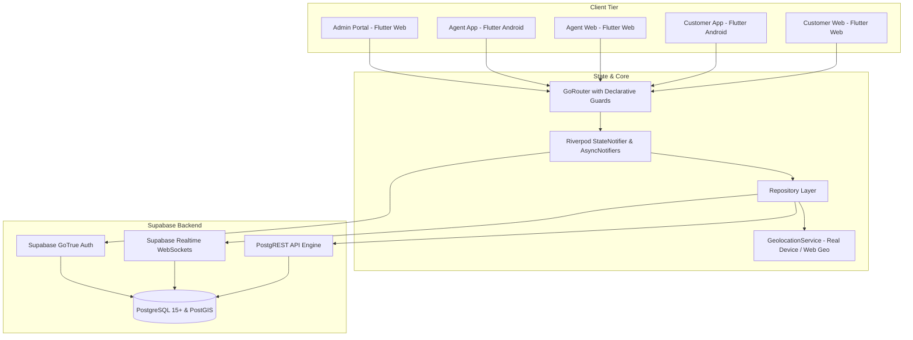
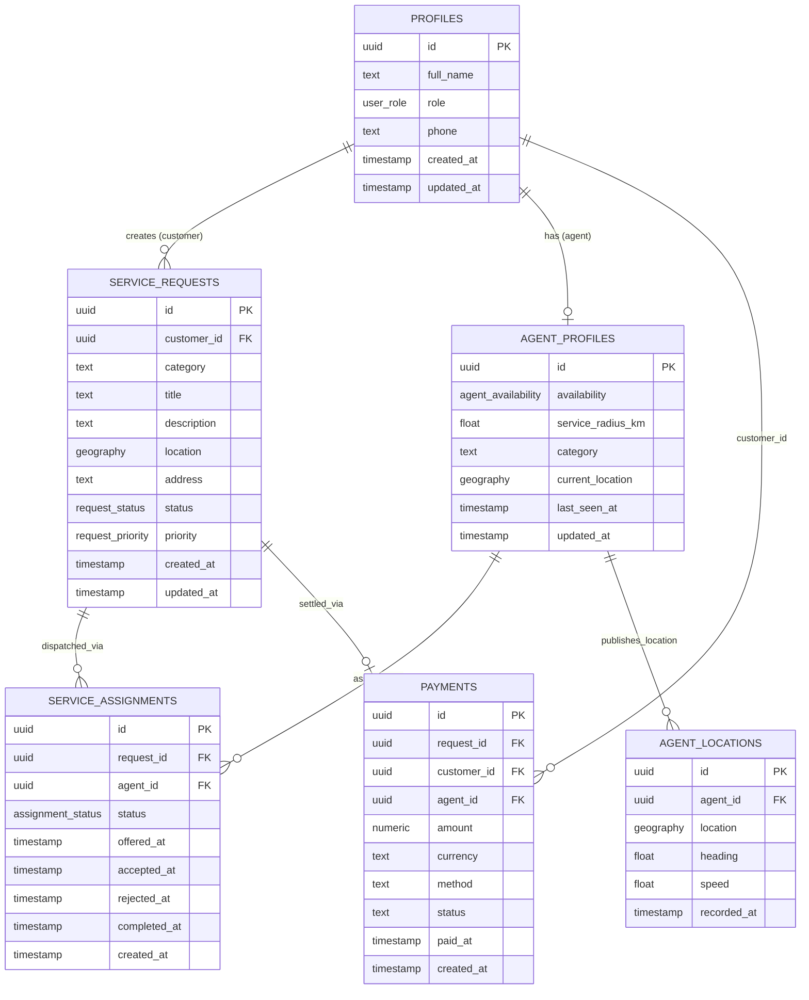
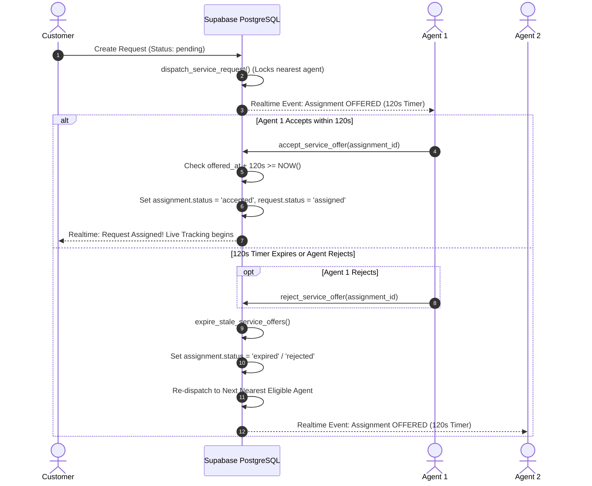

# QuickServe System Architecture & Technical Specifications

This document outlines the architecture, data models, security controls, geospatial dispatch algorithms, and runtime lifecycle for the **QuickServe** hyperlocal on-demand service dispatch platform.

---

## 1. High-Level System Architecture



---

## 2. Layered Architecture & State Management

The Flutter frontend adheres to a strict layered clean-architecture pattern powered by **Riverpod 2.x**:

1. **Presentation Layer**:
   - **Screens & Widgets**: Pure UI layer that listens to providers and delegates user intents to controllers.
   - **Controllers**: Extend `StateNotifier<T>` to manage UI state, error handling, and business operations.
   - **Router (`GoRouter`)**: Declarative routing with `RouterGuard` enforcing role-based page authorization and deep-link security.
2. **Repository Layer**:
   - Abstraction interface and concrete implementations (`AuthRepositoryImpl`, `CustomerRepositoryImpl`, `AgentProfileRepositoryImpl`, `PaymentRepositoryImpl`).
   - Handles data transformation, local client validation (e.g., radius 10–20 km bounds, positive payment amount), and maps raw backend exceptions to typed domain exceptions (`AppException`).
3. **Data / Service Layer**:
   - `SupabaseService`: Encapsulates `SupabaseClient`, query builders, and database tables.
   - `GeolocationService`: Platform-adaptive GPS engine using `geolocator`. Enforces 100% genuine GPS: never injects simulated or fallback coordinates in production.

---

## 3. Database Schema & Entity Relationships



---

## 4. Geospatial Dispatch & Concurrency Engine

### A. Dispatch Algorithm Flow
1. **Creation**: Customer submits a service request (`status: pending`).
2. **Trigger**: Database trigger or client calls `dispatch_service_request(request_id)`.
3. **Candidate Selection**:
   - Finds available agents (`agent_profiles.availability = 'available'`).
   - Filters agents whose active location (`agent_locations.recorded_at >= NOW() - INTERVAL '5 minutes'`) is within both the agent's authoritative service radius (`service_radius_km BETWEEN 10 AND 20`) and the request coordinates.
   - Computes distance using PostGIS `ST_Distance(location::geography, agent_location::geography)`.
   - Orders candidates by `distance ASC` and picks the nearest agent using `FOR UPDATE SKIP LOCKED` on `agent_profiles`.
4. **Offer Assignment**:
   - Creates a record in `service_assignments` with `status: 'offered'` and `offered_at: NOW()`.
   - Transitions request status to `dispatching`.
   - Starts the 120-second offer timer.

### B. 120-Second Offer Expiry & Lifecycle



---

## 5. Security & Privacy Hardening

### A. PostgreSQL Security Definer & Search Path
All transactional database functions executing privileged operations:
- `expire_stale_service_offers()`
- `_dispatch_service_request_internal()`
- `dispatch_service_request(request_id)`
- `accept_service_offer(assignment_id)`
- `reject_service_offer(assignment_id)`

Are explicitly compiled with:
```sql
SECURITY DEFINER
SET search_path = public, extensions
```
- Permissions are strictly revoked from `PUBLIC` and `anon`:
  ```sql
  REVOKE ALL ON FUNCTION function_name FROM PUBLIC, anon;
  GRANT EXECUTE ON FUNCTION function_name TO authenticated;
  ```

### B. Location Privacy Boundary
Customer tracking of agent coordinates is strictly restricted by Row Level Security (RLS):
- **Rule**: A customer can query `agent_locations` **if and only if**:
  1. The agent is assigned to a request owned by the customer (`service_assignments.agent_id = agent_locations.agent_id`).
  2. The assignment status is `'accepted'`.
  3. The service request status is actively `'assigned'` or `'in_progress'`.
- As soon as the service transitions to `'completed'`, `'cancelled'`, or unassigned, location visibility is immediately revoked at the database layer and realtime channel subscription is terminated on the client.

### C. Client Router Guard & Anti-Privilege Escalation
- `RouterGuard` evaluates every route transition against `AppAuthState`.
- Deep links to unauthorized endpoints (e.g., customer navigating to `/agent`, agent to `/customer` or `/admin`) are intercepted synchronously and redirected back to the user's authoritative dashboard.

---

## 6. Testing Strategy

The test suite provides comprehensive coverage across the entire system:
1. **Unit & Model Tests**: Validates serialization, deserialization, enum mappings, GeoJSON parsing, and distance computations.
2. **Repository Hardening Tests**: Enforces authoritatively that non-positive payment amounts are rejected, invalid radius values (<10 or >20 km) fail validation, and domain errors are mapped properly.
3. **Timer & Concurrency Tests**: Verifies that 120-second offer expiration math and remaining seconds windows function correctly under various elapsed intervals.
4. **Router Guard Tests**: Verifies redirects for unauthenticated users, authorized roles, and attempts at role privilege escalation.
5. **Widget Smoke Tests**: Validates authentication screen rendering, text fields, buttons, and state bindings.
